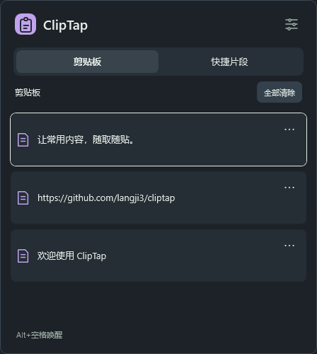

# ClipTap

**让常用内容，随取随贴。** 一个轻量、纯本地的 Windows 剪贴板历史与快捷片段工具。

按 **Alt + 空格** 唤起，左右切换剪贴板与快捷片段，上下选择，回车粘贴。也支持鼠标单击插入。用完即收起，平时留在托盘。

> 当前为 0.1 原型。Windows 原生 WPF 界面；不依赖浏览器运行时，不连接云端，不上传剪贴板。

支持 **浅色 / 深色 / 跟随系统**，默认使用浅色；**蓝 / 绿 / 紫** 三种主题色可独立组合。设置里切换即可预览，保存后记住选择；返回会恢复原主题和主题色。列表、编辑、设置均在同一浮窗内切换，删除和清空使用页内确认。

| 浅色 · 蓝 | 深色 · 紫 |
| --- | --- |
|  |  |

## 使用

1. 在 Windows 设置 → 系统 → 剪贴板中开启「剪贴板历史记录」（也可通过 `Win+V` 开启）。
2. 启动 `ClipTap.exe`，程序驻留托盘；列表直接读取 Windows 已有的文本历史，复制、删除、保留策略由系统管理。
3. 在输入框中按 `Alt+空格` 唤起，选中内容并按回车或单击。
4. `→` 打开快捷片段，点击右下角「＋」保存标题与内容；`F2` 或编辑图标编辑选中片段。
5. 按住顶部图标、标题或空白区域可以拖动浮窗。列表中 `Esc` 收起；编辑/设置中 `Esc` 或左上角返回列表。点击外部暂时收起，重新唤起会保留编辑草稿。右键托盘可打开 Windows 剪贴板设置、ClipTap 设置或退出。

| 操作 | 按键 |
| --- | --- |
| 唤起 / 收起 | Alt + 空格 |
| 切换两个 Tab | ← / → |
| 选择条目 | ↑ / ↓ |
| 粘贴当前条目 | Enter |
| 返回 / 收起 | Esc |
| 保存编辑 / 设置 | Ctrl + S |
| 编辑快捷片段 | F2 |
| 新建快捷片段 | Ctrl + N（片段 Tab） |

从列表收起后再次唤起默认进入剪贴板并选中最新条目；编辑和设置页面暂时收起后继续当前页面。通过托盘打开时只复制；通过快捷键打开时记录原输入窗口，尝试恢复焦点后发送 Ctrl+V。没有有效目标、目标已关闭或焦点无法核验时，只复制并提示手动粘贴。操作系统不能保证识别所有应用内的可编辑控件。

## 数据与敏感片段

- 剪贴板历史以 **Windows / Win+V 为唯一数据源**，唤起及系统历史变化时刷新；不自行采集、去重或长期保存。历史未开启或不可访问时显示状态和系统设置入口。
- 当前只展示系统历史中的文本，图片/文件不展示；文本历史不套用 ClipTap 的片段长度限制。清空调用 Windows 接口，影响 Win+V，系统固定项保留。
- 快捷片段和外观设置存于 `%LOCALAPPDATA%\ClipTap\library.dat`，使用 Windows DPAPI 加密，绑定当前 Windows 用户。旧版已经保存的本地历史保留在原库中以兼容升级，但不再显示，也不会导入新系统历史。
- 最多 500 个快捷片段，单个片段最多 20,000 字符。
- 列表仅显示片段标题和状态。敏感内容在编辑器中默认遮蔽，使用前会确认。
- 与敏感片段值完全相同的系统文本会在 ClipTap 列表中隐藏；不会擅自删除 Windows 中已经存在的记录。将片段设为敏感时，仍会移除旧版本地库中的匹配历史。
- 使用敏感片段时附加 Windows 剪贴板历史/同步排除标记；30 秒后仅在剪贴板仍是本次写入内容时尝试清除，避免覆盖后续复制。
- **系统剪贴板并非密码保险箱**：其他程序仍可能读取当前内容；排除标记不约束所有第三方工具。加密保护的是落盘文件，程序运行中仍需在内存里使用明文。
- 无法解密已有文件时停止启动并保留原文件，不自动重置。跨 Windows 用户或系统重装后可能无法解密，请勿将此工具作为密码的唯一备份。
- 历史可能包含从其他应用复制的敏感文本；不会自动识别任意密码。系统历史是否开启由 Windows 管理。

## 开发与运行

需要 Windows 10 1809 或更新版本 / Windows 11、**.NET 10 SDK**。安装地址：[Microsoft .NET 10](https://dotnet.microsoft.com/download/dotnet/10.0)。脚本支持 `DOTNET_ROOT`、`D:\dotnet` 和 PATH 中的 SDK；Windows 目标框架自动引用 WinRT SDK，无需引入浏览器运行时。

```powershell
# 构建并执行测试
powershell -ExecutionPolicy Bypass -File scripts/build.ps1

# 构建并启动托盘程序
powershell -ExecutionPolicy Bypass -File scripts/run.ps1

# 轻量发布包，需要 .NET 10 Desktop Runtime
powershell -ExecutionPolicy Bypass -File scripts/publish.ps1

# 独立运行包，包含 .NET 运行时，体积更大
powershell -ExecutionPolicy Bypass -File scripts/publish.ps1 -SelfContained
```

产物在 `artifacts/`。发布包先解压到固定位置再开启「登录 Windows 时启动」。移动或删除程序后，应重新配置或关闭开机启动。默认不修改开机启动。

后台启动仅保留托盘与消息监听，浮窗首次唤起时才创建。[首版验证记录](docs/verification-20260916.md) 列出了测试结果和待补验场景。

## 验证

测试宿主不引入外部测试框架，失败返回非零退出码。覆盖系统历史快照替换、删除同步、禁用/拒绝访问、旧请求竞争、敏感值过滤、DPAPI 往返与损坏检测、WPF 导航与编辑器遮蔽；测试使用隔离数据，不清空真实系统历史。测试截图保存在 `artifacts/test-results/`。

可选只读原生探测：`dotnet run --project tests/ClipTap.Tests -c Release -- --system-history`，仅打印状态和文本条数，不输出剪贴板内容。原生接入使用 Microsoft 的 [GetHistoryItemsAsync](https://learn.microsoft.com/en-us/uwp/api/windows.applicationmodel.datatransfer.clipboard.gethistoryitemsasync) 和 [ClearHistory](https://learn.microsoft.com/en-us/uwp/api/windows.applicationmodel.datatransfer.clipboard.clearhistory) 接口。

可选的跨进程粘贴测试会打开专用测试输入窗口，临时写入测试剪贴板并在未被外部更新时恢复备份。运行时请让测试窗口保持前台：

```powershell
powershell -ExecutionPolicy Bypass -File scripts/build.ps1 -Integration
```

CI 执行默认测试，交互桌面的跨应用粘贴需要在真实环境另行确认。

## 已知边界与后续

- 尚未实现 `!hzpass` 一类触发词展开、图片/文件历史、搜索、云同步和自定义快捷键。
- 默认快捷键被其他应用占用时，会提示改用托盘。
- Windows 可能阻止向管理员窗口发送输入；当前版本不请求管理员权限。
- 不同应用对 Ctrl+V、输入焦点的处理不同；多屏不同缩放、终端、浏览器和远程桌面仍需进一步兼容性验证。
- 尚未提供签名安装器和自动更新。

## 结构

```text
src/ClipTap.Core/       历史与片段规则
src/ClipTap/            WPF 界面、托盘、Windows 集成与加密存储
tests/ClipTap.Tests/    规则、集成及界面测试
scripts/               构建、运行、打包
tools/IconBuilder/     生成多尺寸 ICO（与托盘共用绘制代码）
docs/specs/            中文需求与范围
```

采用 [MIT License](LICENSE)。
