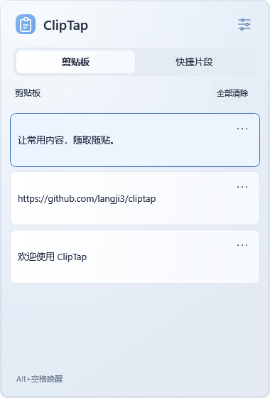
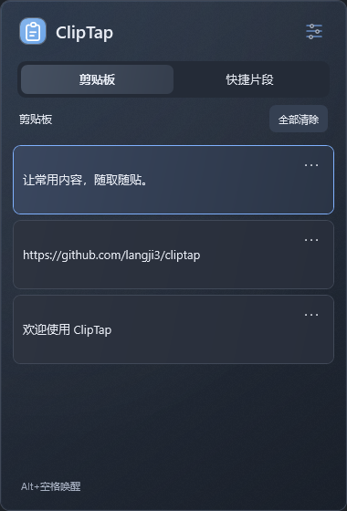

# ClipTap

**让常用内容，随取随贴。** 一个轻量、纯本地的 Windows 剪贴板历史与快捷片段工具。

按 **Alt + 空格** 唤起，左右切换剪贴板与快捷片段，上下选择，回车粘贴。也支持鼠标单击插入。用完即收起，平时留在托盘。

> 当前版本为 0.1.3。Windows 原生 WPF 界面；不依赖浏览器运行时，不上传剪贴板。安装版仅在用户主动检查或下载更新时访问 GitHub。

支持 **浅色 / 深色 / 跟随系统**，首次使用默认浅色和蓝色主题，图标使用浅蓝色；**蓝 / 绿 / 紫** 三种主题色可独立组合。设置里切换即可预览，保存后记住选择；返回会恢复原主题和主题色。列表、编辑、设置均在同一浮窗内切换，删除和清空使用页内确认。

浮窗采用**细磨砂纹理与柔光边缘**，浅色呈现淡蓝灰质感，深色保持柔和层次；卡片和输入框保持实色，保证内容清晰。材质由静态纹理和渐变绘制，不采样或透出桌面内容。

| 浅色 · 蓝 | 深色 · 蓝 |
| --- | --- |
|  |  |

## 使用

### 下载和安装

正式版本从 [GitHub Releases](https://github.com/langji3/cliptap/releases/latest) 下载。首次使用推荐下载 [EXE 安装包](https://github.com/langji3/cliptap/releases/latest/download/ClipTap-win-x64-setup.exe)，免安装可选 [便携版](https://github.com/langji3/cliptap/releases/latest/download/ClipTap-win-x64-portable.zip)。[GitHub Actions](https://github.com/langji3/cliptap/actions) 的成功构建另提供开发构建产物，需登录 GitHub 下载。

- **安装版**：下载并双击 `ClipTap-win-x64-setup.exe`，按中文向导选择安装位置并完成安装。完成页默认勾选“安装后运行 ClipTap”，启动后驻留托盘，不弹主窗口。不创建桌面或开始菜单快捷方式；支持在 Windows“已安装的应用”卸载。自带运行时，无需管理员权限。
- **便携版**：下载 `ClipTap-win-x64-portable.zip`，完整解压到固定目录后启动 `ClipTap.exe`。自带运行时，不安装、不提供检查更新。
- **轻量包**：`ClipTap-win-x64-framework-dependent.zip` 需要先安装 .NET 10 Desktop Runtime（x64）。同样解压运行，不提供检查更新。

安装版设置页提供“检查更新”，发现新版本后点击“立即更新”：自动下载并验证 GitHub 提供的 SHA-256，保存数据、退出旧版，在当前安装目录静默覆盖，完成后重新驻留托盘。无需重新选择目录或操作安装向导，不重启 Windows；例如安装在 `D:\ClipTap`，更新仍在该目录。下载显示进度，可以取消；下载或校验失败不会退出当前程序。安装失败会显示提示并保留安装日志。更新不上传片段内容，保留已保存的片段和设置。

也可点击“前往下载页”手动下载安装包。`v0.1.2` 及以上安装版支持一键更新；`v0.1.0` / `v0.1.1` 用户需先手动安装最新版，之后即可一键更新。便携版不提供更新入口。卸载保留已保存片段和设置。

1. 在 Windows 设置 → 系统 → 剪贴板中开启「剪贴板历史记录」（也可通过 `Win+V` 开启）。
2. 启动 `ClipTap.exe`，程序驻留托盘；列表直接读取 Windows 已有的文本和图片历史，复制、删除、保留策略由系统管理。
3. 在输入框中按 `Alt+空格` 唤起，选中内容并按回车或单击。
4. `→` 打开快捷片段，点击右下角「＋」保存标题与内容；`F2` 或编辑图标编辑选中片段。
5. 按住顶部图标、标题或空白区域可以拖动浮窗。列表中 `Esc` 收起；编辑/设置中 `Esc` 或左上角返回列表。点击外部暂时收起，重新唤起会保留编辑草稿。右键托盘可打开 Windows 剪贴板设置、ClipTap 设置或退出。
6. 历史卡片右侧「…」展开删除操作，顶部「全部清除」清理系统历史，均在面板内确认。固定记录仍在 Win+V 操作；现有 Tab 切换保持不变。唤起带约 240ms 缩放缓出、180ms 淡入和轻微上移，遵循 Windows 动画开关。
7. 在片段编辑器填写可选的「触发词」，例如 `!hzpass`。保存后回到其他应用的输入框，在英文输入状态下连续输入，打完即替换为片段内容。触发词留空关闭该项自动替换；托盘可暂停/恢复全部自动替换。

触发词为 `!` 加 2–31 个小写字母、数字或下划线，末尾必须是字母或数字。区分大小写，不能重复或互为前缀。自动替换支持最多 2000 字符的单行内容，多行仍从面板粘贴。输入错字后可用普通退格删除并继续输入，也支持长按退格；点击鼠标、切换焦点、移动光标、Delete、组合键、输入法变化或超过 5 秒的输入间隔会取消匹配。片段保存、修改、删除后立即生效。

| 操作 | 按键 |
| --- | --- |
| 唤起 / 收起 | Alt + 空格 |
| 切换两个 Tab | ← / → |
| 选择条目 | ↑ / ↓ |
| 粘贴当前条目 | Enter |
| 返回 / 收起 | Esc |
| 保存编辑 / 设置 | Ctrl + S |
| 编辑快捷片段 | F2 |
| 新建快捷片段 | Ctrl + N（片段 Tab） |

从列表收起后再次唤起默认进入剪贴板并选中最新条目；编辑和设置页面暂时收起后继续当前页面。通过托盘打开时只复制；通过快捷键打开时记录原输入窗口，尝试恢复焦点后发送 Ctrl+V。没有有效目标、目标已关闭或焦点无法核验时，只复制并提示手动粘贴。操作系统不能保证识别所有应用内的可编辑控件。

## 数据与敏感片段

- 剪贴板历史以 **Windows / Win+V 为唯一数据源**，唤起及系统历史变化时刷新；不自行采集、去重或长期保存。历史未开启或不可访问时显示状态和系统设置入口。
- 展示文本和图片，图片带缩略图，暂不展示文件。选中图片后由 Windows 恢复原始历史内容再发送粘贴，缩略图不会替代原图；目标应用需要支持图片粘贴。文本历史不套用 ClipTap 的片段长度限制。清空调用 Windows 接口，影响 Win+V，系统固定项保留。
- 图片预览读取系统记录的原始像素，不预先缩小分辨率；仅在卡片内以高质量插值按比例显示，适配高 DPI。只存内存，较大图片会使用更多内存。读取超时或预览失败时保留图片条目。原记录已删除或无法恢复时显示简短错误，不发送粘贴。
- 快捷片段和外观设置存于 `%LOCALAPPDATA%\ClipTap\library.dat`，使用 Windows DPAPI 加密，绑定当前 Windows 用户。旧版已经保存的本地历史保留在原库中以兼容升级，但不再显示，也不会导入新系统历史。
- 最多 500 个快捷片段，单个片段最多 20,000 字符。
- 列表仅显示片段标题和状态，悬停可查看触发词。敏感内容在编辑器中默认遮蔽，从面板粘贴前会确认。为敏感片段配置触发词后，输入完整触发词会直接展开，不另行确认。
- 自动替换使用 Windows Unicode 输入，不写剪贴板，也不创建历史记录；后台只保留已配置触发词的短前缀和错字数量，不保存错字内容、不记录或上传日常键盘输入。监听在独立消息线程运行，不受面板绘制或磁盘保存阻塞。失败后暂停，托盘可恢复。
- 与敏感片段值完全相同的系统文本会在 ClipTap 列表中隐藏；不会擅自删除 Windows 中已经存在的记录。将片段设为敏感时，仍会移除旧版本地库中的匹配历史。
- 从面板粘贴敏感片段时附加 Windows 剪贴板历史/同步排除标记；30 秒后仅在剪贴板仍是本次写入内容时尝试清除，避免覆盖后续复制。
- **系统剪贴板并非密码保险箱**：其他程序仍可能读取当前内容；排除标记不约束所有第三方工具。加密保护的是落盘文件，程序运行中仍需在内存里使用明文。
- 无法解密已有文件时停止启动并保留原文件，不自动重置。跨 Windows 用户或系统重装后可能无法解密，请勿将此工具作为密码的唯一备份。
- 历史可能包含从其他应用复制的敏感文本；不会自动识别任意密码。系统历史是否开启由 Windows 管理。

## 开发与运行

需要 Windows 10 1809 或更新版本 / Windows 11、**.NET 10 SDK**。安装地址：[Microsoft .NET 10](https://dotnet.microsoft.com/download/dotnet/10.0)。脚本支持 `DOTNET_ROOT`、`D:\dotnet` 和 PATH 中的 SDK；Windows 目标框架自动引用 WinRT SDK，无需引入浏览器运行时。

```powershell
# 构建并执行测试
powershell -ExecutionPolicy Bypass -File scripts/build.ps1

# 构建并启动托盘程序
powershell -ExecutionPolicy Bypass -File scripts/run.ps1

# 轻量发布包，需要 .NET 10 Desktop Runtime
powershell -ExecutionPolicy Bypass -File scripts/publish.ps1

# 独立运行包，包含 .NET 运行时，体积更大
powershell -ExecutionPolicy Bypass -File scripts/publish.ps1 -SelfContained

# EXE 安装向导，包含运行时和检查更新入口
powershell -ExecutionPolicy Bypass -File scripts/package-installed.ps1
```

产物在 `artifacts/`。发布包先解压到固定位置再开启「登录 Windows 时启动」。移动或删除程序后，应重新配置或关闭开机启动。默认不修改开机启动。

后台启动仅保留托盘与消息监听，浮窗首次唤起时才创建。[首版验证记录](docs/verification-20260916.md) 列出了测试结果和待补验场景。

## 验证

测试宿主不引入外部测试框架，失败返回非零退出码。覆盖系统历史快照替换、删除同步、禁用/拒绝访问、旧请求竞争、敏感值过滤、DPAPI 往返与损坏检测、WPF 导航与编辑器遮蔽；测试使用隔离数据，不清空真实系统历史。测试截图保存在 `artifacts/test-results/`。

可选只读原生探测：`dotnet run --project tests/ClipTap.Tests -c Release -- --system-history`，仅打印状态和文本/图片条数，不输出剪贴板内容。原生接入使用 Microsoft 的 [GetHistoryItemsAsync](https://learn.microsoft.com/en-us/uwp/api/windows.applicationmodel.datatransfer.clipboard.gethistoryitemsasync)、[ClearHistory](https://learn.microsoft.com/en-us/uwp/api/windows.applicationmodel.datatransfer.clipboard.clearhistory) 和 [SetHistoryItemAsContent](https://learn.microsoft.com/en-us/uwp/api/windows.applicationmodel.datatransfer.clipboard.sethistoryitemascontent) 接口。

可选的跨进程粘贴测试会打开专用测试输入窗口，临时写入测试剪贴板并在未被外部更新时恢复备份。运行时请让测试窗口保持前台：

```powershell
powershell -ExecutionPolicy Bypass -File scripts/build.ps1 -Integration
```

CI 执行默认测试，交互桌面的跨应用粘贴需要在真实环境另行确认。

快捷替换集成验证：`dotnet run --project tests/ClipTap.Tests -c Release -- --expansion-integration`。仅向独立的测试输入窗口注入标记过的虚构输入（生产监听忽略外部注入），验证原生钩子、替换、焦点保护、暂停和配置更新，不写真实剪贴板。详见 [快捷替换验证记录](docs/verification-20260917-expansion.md)。

## 已知边界与后续

- 尚未实现文件历史、搜索、云同步和自定义快捷键。
- 自动替换需要目标控件支持 Windows Unicode 输入。支持中文输入法的半角英文模式，即使输入法仍报告为开启；中文组词、全角/特殊转换模式或输入法状态无法确认时跳过。若输入法英文模式仍不可用，可通过 Win+空格切换英文键盘布局。终端、远程桌面、自动完成或拦截按键的自定义控件仍需兼容性验证。部分输入失败可能留下不完整文字；不会继续删除或自动重试，请检查输入框后在托盘恢复。
- 默认快捷键被其他应用占用时，会提示改用托盘。
- Windows 可能阻止向管理员窗口发送输入；当前版本不请求管理员权限。
- 不同应用对 Ctrl+V、输入焦点的处理不同；多屏不同缩放、终端、浏览器和远程桌面仍需进一步兼容性验证。
- 尚未提供签名安装器和自动更新。

发布维护：安装包的 GitHub Release 附件名称应为 `ClipTap-win-x64-setup.exe`，稳定版标签使用 `v主版本.次版本.修订号`，并与项目 `Version` 一致。设置页只检查带安装包的稳定新版；尚未发布时显示“暂未发布正式版本”。构建首次运行时自动下载并校验 Inno Setup 编译器，缓存到 `artifacts/tools`，或使用 `INNO_SETUP_COMPILER` 指定本机 `ISCC.exe`。

## 结构

```text
src/ClipTap.Core/       历史与片段规则
src/ClipTap/            WPF 界面、托盘、Windows 集成与加密存储
tests/ClipTap.Tests/    规则、集成及界面测试
scripts/               构建、运行、打包
tools/IconBuilder/     生成多尺寸 ICO（与托盘共用绘制代码）
docs/specs/            中文需求与范围
```

采用 [MIT License](LICENSE)。
